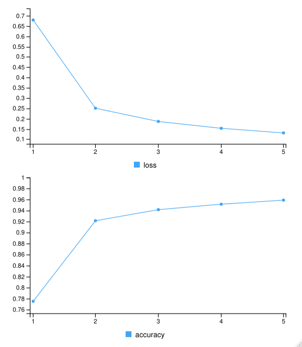
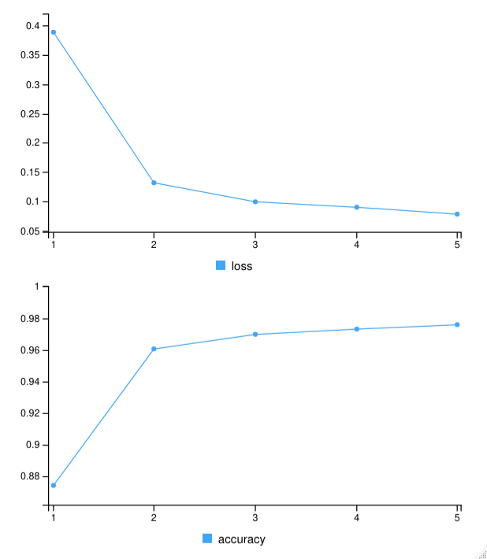

# Introduction
MNIST ("Modified National Institute of Standards and Technology") is the de
facto “hello world” dataset of computer vision. It consists of 70000, 28 by 28
grayscale images of handwritten digits, 10000 of which are in a separate 
testing set. Even though this data set is was first released in 1999 it is still 
widely used to this day as the basis for benchmarking classification algorithms. 
As new machine learning techniques emerge, MNIST remains a reliable resource 
for researchers and learners alike.
 
# Exploring the data
We will be using Keras to implement our neural network and ggplot for some
visualizations
```{r}
library(keras)
library(ggplot2)
```

Let's import the data and see how representative our sample is

```{r echo=FALSE}
train = read.csv('../data/mnist_train.csv')
test = read.csv('../data/mnist_test.csv')

ggplot(train,aes(x=as.factor(label),fill=label))+
geom_bar(stat="count",color="white")+
scale_fill_gradient(low="lightblue",high="pink",guide=FALSE)+
labs(title="Digits in Train Data",x="Digits")
```

As we can see the sample is in fact not skewed. Let's turn the labels into a 
categorical variable and normalize our data. Finally, we change the dimensions
of our matrix from ``786x1x1`` to ``28x28x1``. Note that the last ``1`` here 
represents our depth which in this case is 1 since we are using grayscale images
 (if these were colored the depth would have been 3, one for each RGB layer). 
 Before all of this we will be turning our two data frames into matrices.
```{r}
train = data.matrix(train)
test = data.matrix(test)

train.label=train[,1] %>% to_categorical()

train.feature=train[,-1] %>% normalize()
test.feature=test %>% normalize()

dim(train.feature) = c(nrow(train.feature),28,28,1)
dim(test.feature) = c(nrow(test.feature),28,28,1)
```


Let's plot the first few images from the training set to get an idea of what they 
look like.

```{r echo=FALSE}
plotTrain = function(images){
  op = par(no.readonly=TRUE)
  x = ceiling(sqrt(length(images)))
  par(mfrow=c(x, x), mar=c(.1, .1, .1, .1))
  
  for (i in images){ #reverse and transpose each matrix to rotate images
    m = matrix(train[i,-1], nrow=28, byrow=TRUE)
    m = apply(m, 2, rev)
    image(t(m), col=grey.colors(255), axes=FALSE)
    text(0.05, 0.2, col="white", cex=1.2, train[i, 1])
  }
  par(op) #reset the original graphics parameters
}

plotTrain(1:36)
```

As you would expect from handwritten numbers, they are very inconsistent; 
tackling this with traditional programming would be next to impossible. 
There are a couple of different approaches we can take from which I will be 
sticking with Convolutional Neural Networks.

# What are Convolutional Neural Networks (CNNs) and why should we use them?

Convolutional Neural Networks are a class of Neural Networks, what makes them 
different is their spacial invariance. The reason CNNs are used in computer 
vision over traditional ANNs is simply because the "fully-connectedness" which
ANNs bring to the table causes heavy overfit. While traditional ANNs would be 
*looking* for more exact, higher level patterns in data, CNNs take a different 
approach towards regularization: they take advantage of the hierarchical 
pattern in data and assemble more complex patterns using smaller and simpler 
patterns. Their architecture usually consists of and input and output layer 
as well as multiple hidden layers. The type's of layers are:\

- **Convolutional**\
  When programming a CNN, the input is a tensor with shape ``(number of images) x 
  (image height) x (image width) x (image depth)``. Then after passing through a 
  convolutional layer, the image becomes abstracted to a feature map, with shape 
  ``(number of images) x (feature map height) x (feature map width) x 
  (feature map channels)``.
- **Pooling**\
  Pooling layers reduce the dimensions of the data by combining the outputs of 
  neuron clusters at one layer into a single neuron in the next layer.
- **Fully connected**\
  Fully connected layers connect every neuron in one layer to every neuron in 
  another layer. It is in principle the same as the traditional multi-layer 
  perceptron neural network (MLP). The flattened matrix goes through a fully 
  connected layer to classify the images.
  
With all that said it's finally time to design our first CVV.

# Designing the first CVV.

We will start with a very simple architecture and later on I will be showcasing 
a model that got me a slightly better accuracy at the cost of complexity.

```{r}
model = keras_model_sequential() %>%
  
  layer_conv_2d(filters = 32, kernel_size = c(3,3), activation = 'relu',
                input_shape = c(28,28,1)) %>%
  
  layer_max_pooling_2d(pool_size = c(2,2)) %>%
  
  layer_conv_2d(filters = 64, kernel_size = c(3,3), activation = 'relu') %>%
  
  layer_max_pooling_2d(pool_size = c(2,2)) %>%
  
  layer_conv_2d(filters = 64, kernel_size = c(3,3))%>%
  
  layer_flatten() %>%
  
  layer_dense(units = 64, activation = 'relu') %>%
  
  layer_dense(units = 10, activation = 'softmax')
```

Let's break this down. The first 4 layers are a Convolution layer followed by a 
pooling layer and this pattern is repeated twice. This combination is fairly 
common in practice as it is a good way to both extract features and at the same 
time streamline the underlying computation. The only thing worth noting here is
the increased number of filters in the second convolution layer. Filters are 
there to capture patterns such as edges, corners etc. As we get deeper and 
deeper into our network we combine those patterns to make bigger patterns and 
as a result, the patterns become more complicated which is why we increase the 
number of filters. These are followed by one last Convolution layer and then by 
a Flattening layer. The flattening layers reduce the data to a one dimensional 
vector so that they can be fed to a new network later on. Finally we have 2 
fully conected layers that end with 10 neurons which represent our 10 possible 
outcomes (numbers from 0 to 9). Let's compile and train our network to see how 
accurate it is.

```{r echo=FALSE}
model %>% compile(
  loss='categorical_crossentropy',
  optimizer='adam',
  metrics='accuracy'
)

datagen = image_data_generator(
  featurewise_center = F,
  samplewise_center=F,
  featurewise_std_normalization = F,
  samplewise_std_normalization=F,
  zca_whitening=F,
  horizontal_flip = F,
  vertical_flip = F,
  width_shift_range = 0.15,
  height_shift_range = 0.15,
  zoom_range = 0.15,
  rotation_range = .15,
  shear_range = 0.15
)

datagen %>% fit_image_data_generator(train.feature)

history=model %>%
  fit_generator(flow_images_from_data(train.feature, train.label, 
                                      datagen, batch_size = 64),
                steps_per_epoch = nrow(train.feature)/64, epochs = 5)

# plot(history)
```


As we can see even this simple architecture achieves a great accuracy. This is 
based on the training set however so just to make sure we aren't just 
overfitting let's see how well we do in the test set.

```{r echo=FALSE}
pred = model %>% predict_classes(test.feature,batch_size=64)

plotResults = function(images, preds){
  op = par(no.readonly=TRUE)
  x = ceiling(sqrt(length(images)))
  par(mfrow=c(x,x), mar=c(.1,.1,.1,.1))
  
  for (i in images){
    m = matrix(test[i,], nrow=28, byrow=TRUE)
    m = apply(m, 2, rev)
    image(t(m), col=grey.colors(255), axes=FALSE)
    text(0.05,0.1,col="red", cex=1.2, preds[i])
  }
  par(op)
}

plotResults(1:36, pred)
```

Looking at this small sample it is safe to assume that we have indeed achieved 
a good accuracy with our model. This was my first submission to [this](https://www.kaggle.com/c/digit-recognizer) kaggle 
competition and this would be the last 2 lines of code to run in order to 
export the relevant csv file.

```{r}
cnnsubmission = data.frame(ImageId=1:nrow(test),Label=pred)
write.csv(cnnsubmission, file="output.csv", row.names=F)
```

However, we can do better.

# Improving the previous model

Since the previous model was already pretty accurate we will be keeping its core 
ideas and we will be expanding and improving on them.

New layers:\

- Dropout layer
  Dropout is a regularization technique used to reduce over-fitting on neural 
  networks. sually, deep learning models use dropout on the fully connected 
  layers, but is also possible to use dropout after the max-pooling layers, 
  creating image noise augmentation.
- Normalization layer
  Normalizes the activation of the previous layer at each batch (i.e. applies 
  a transformation that maintains the mean activation close to 0 and the 
  standard deviation close to 1)
  
The idea here is to add dropout layers to make sure we don't accidentally 
overfit (even if it's already unlikely with the use of a big enough CNN) and 
combine them with normalization to lessen the effect of outliers.

I also added 2 more dense layers at the end to make the output a little bit more 
accurate.

```{r}
model = keras_model_sequential() %>%
  
  layer_batch_normalization() %>%
  
  layer_conv_2d(filters = 32, kernel_size = c(5,5), padding = 'valid',
                activation = 'relu', input_shape = c(28,28,1)) %>%
  
  layer_batch_normalization() %>%
  
  layer_conv_2d(filters = 32, kernel_size = c(5,5), padding = 'valid',
                activation = 'relu', input_shape = c(28,28,1)) %>%
  
  layer_max_pooling_2d(pool_size = c(2, 2)) %>% 
  
  layer_dropout(rate = 0.2) %>% 
  
  layer_batch_normalization() %>%
  
  layer_conv_2d(filters = 64, kernel_size = c(3,3), padding = 'valid',
                activation = 'relu') %>%
  
  layer_max_pooling_2d(pool_size = c(2, 2)) %>% 
  
  layer_dropout(rate = 0.2) %>% 
  
  layer_flatten() %>%
  
  layer_dense(units=1024,activation='relu') %>%
  
  layer_dense(units=512,activation='relu') %>%
  
  layer_dense(units=256,activation='relu') %>%
  
  layer_dense(units=10,activation='softmax')
```

So, let's train the model and see how it compares.

```{r echo=FALSE}
model %>% compile(
  loss='categorical_crossentropy',
  optimizer='adam',
  metrics='accuracy'
)

datagen = image_data_generator(
  featurewise_center = F,
  samplewise_center=F,
  featurewise_std_normalization = F,
  samplewise_std_normalization=F,
  zca_whitening=F,
  horizontal_flip = F,
  vertical_flip = F,
  width_shift_range = 0.15,
  height_shift_range = 0.15,
  zoom_range = 0.15,
  rotation_range = .15,
  shear_range = 0.15
)

datagen %>% fit_image_data_generator(train.feature)

history = model %>%
  fit_generator(flow_images_from_data(train.feature, train.label, 
                                      datagen, batch_size = 64),
                steps_per_epoch = nrow(train.feature)/64, epochs = 5)

# plot(history)
```


We can immediately see a 3% accuracy increase which is a good sign! Keep in mind 
that 5 epochs is a very small amount and the only reason that they are used here 
is for the sake of the example (and so I don't have to wait for 5 minutes every 
time I recompile the article), I found personally that 30 epochs is a great 
amount for this network but feel free to experiment with that. 

# Conclusion
CNNs are just one way of tackling the MNIST dataset, algorithms such as K-NN, 
SVMs as well as Random Forests can also be used for a very close accuracy score. 
With CNNs we were able to achieve a 95+ accuracy with even a very simple model 
and just 5 epochs and we saw that with some tweaking we can improve that to 98+. 
With further training the model plateaued at about 99% which is a near perfect 
score and it just goes to show the power of Neural Networks and Convolution in 
particular.